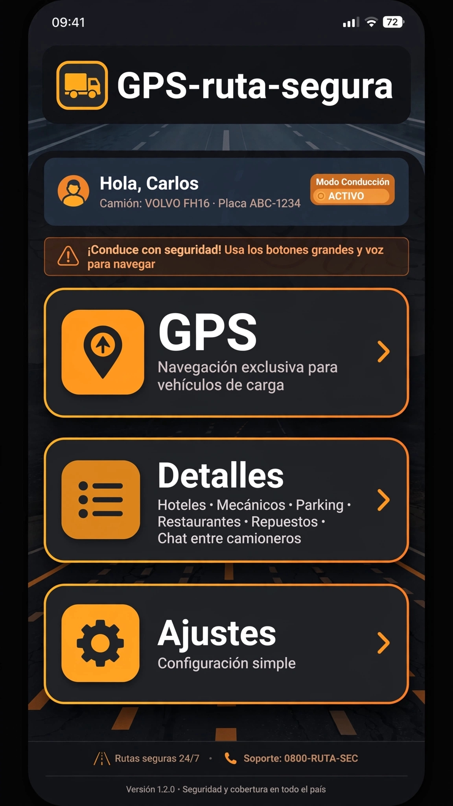

# GPS-ruta-segura 🚛
### Waze para Transporte de Carga Pesada en Colombia

**Pantalla Principal:**
1.  **GPS** - Navegación exclusiva para vehículos de carga
2.  **Detalles** - Hoteles, Mecánicos, Parqueaderos, Restaurantes, 
    Almacenes de Repuestos, Chat Online entre camioneros
3.  **Ajustes** - Configuración simple
    
**Diseño:** Botones grandes y fáciles de usar mientras se conduce

**Problema que resuelve:**
Evitar rutas no aptas, perderse, y encontrar servicios en carretera
rápido y seguro.

**Autor:** Diego Salas - 20 años en Transporte + SENA Programación
**Estado:** En desarrollo
 ### Pantallazo de la App
 
### ¿Para quién es?
**Para Transportadoras y Flotas**

Deje de pelear por 3 choferes veteranos.
Con GPS-ruta-segura puede contratar 20 jóvenes y ponerlos a rodar 
el lunes. La app hace de copiloto, de mecánico y de padrino.

**Menos riesgo. Menos multas. Más viajes. Más ganancia.**
### Ecosistema de Publicidad GPS-ruta-segura
La app conecta al camionero con todo lo que necesita en ruta:

**Mecánica y Repuestos:** Baterías, Rodillos, Llantas, Aceites, 
Talleres de Motor, Latonería y Pintura, Servicio de Escaneo

**Servicios de Emergencia:** Grua 24h, Carro Taller, Lavaderos

**Descanso:** Hoteles, Restaurantes, Farmacias, Tiendas de Abarrotes

**Lujos:** Accesorios, Personalización para tractomulas

**Ganamos cuando el camionero gana.** Él llega seguro. 
El negocio local vende. Todos felices.
